<picture>
  <source media="(prefers-color-scheme: dark)" srcset="assets/header-dark.svg">
  
</picture>

 

I build web and mobile products end to end, from the first sketch to a shipped app. Most of my work lives in **TypeScript**: Next.js web apps, React Native / Expo mobile apps and the Node.js services behind them. Lately I've also been writing native **Swift** for macOS.

- 🌐 **Web & SaaS:** multi-tenant dashboards, ticketing, subscription commerce
- 📱 **Mobile:** cross-platform with React Native / Expo, native with Swift
- ⚙️ **Backend & tooling:** REST APIs, background jobs and automation in Node.js and Python

<h3>Stack</h3>

<picture>
  <source media="(prefers-color-scheme: dark)" srcset="assets/stack-dark.svg">
  
</picture>

  

<picture>
  <source media="(prefers-color-scheme: dark)" srcset="https://raw.githubusercontent.com/uemrey0/uemrey0/output/snake-dark.svg">
  
</picture>

 

